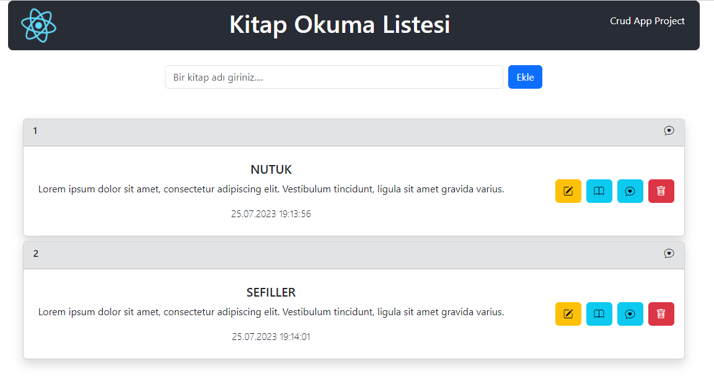

### React Project 4
# CRUD APP
# KİTAP OKUMA LİSTESİ

## CREATE READ UPDATE DELETE APP çalışmasıdır...
- Bu çalışmada aşamaları şöyle oluşturuldu

- 1 Form içerisinde gelen verileri al ve state'e aktar.
- - Ekle butonuna tıklanılınca formdan gelen kitap ismiyle beraber yeni bir obje oluştur.
- - Değerleri: Eklenme Tarihi | Kitap İsmi | id | okunduMu | favorilere ekle
- - Oluşan objeyi kitaplar isminde bnir diziyi tutan state'e aktar
- - Son aşamada inputu temizle

- 2 State'de tutulan verileri al ve map methodu ile listele(ekrana bas)
- - Eğer state boşsa ekrana "uyarı" yaz
- - Card bileşenine kitap bilgilerini prop olrak gönder
- - Bileşende kitapla iligli bütün özellikleri göster

- 3 Kitap Silme:
- - Herhangi bir kitabın sil butonun basıldığında
- - fonk. çalıştır ve silincek elemanın id'sini gönder `handleModal(id)`
- - bir onay modal'ı aç:
- - Vazgeçe tıklanırsa kapat `setShowModal(false)`
- - Onaylanırsa silincek id'ye eşit olmaynlarla yeni bir dizi oluştur
- - Oluşan yeni diziye state'e aktar `handleDelete()`

- 4 Okundu olarak işaretle:
- - Okundu butonuna tılanılınca çalışan fonk. kitab değerlerini gönder
- - Read değerini tersine çevir
- - dizi içerinde değişicek elemanı bul
- - değişecek elemanı çıkar yerine güncel halini ekle
- - state'i güncelle

- 5 Düzenle İşlemini Yap:
- - Düzenle butonuan tıklanıldığında bir fonk. çalışsın
- - Fonksiyon düzenlenecek kitabı state'e aktarsın ve modal'ı açsın
- - Modalda: Kitap ismini değiştirmek için bir input olsun (value'su kitabın ismi olucak)
- - Input her değiştiğinde düznlenecek elemanı tutuğun state'i güncelle
- - Vazgeç butonu: > Modal'ı kapatır
- - Kaydet Butonu: > `handleEditBook` fonk. çalıştırsın
- - çalışan fonksiyon kitaplar dizisni güncellesin 
- - Günncellerken isim ve date'i değiştir

## Preview

# Getting Started with Create React App

This project was bootstrapped with [Create React App](https://github.com/facebook/create-react-app).

## Available Scripts

In the project directory, you can run:

### `npm start`

Runs the app in the development mode.\
Open [http://localhost:3000](http://localhost:3000) to view it in your browser.

# Getting Started with Create React App

This project was bootstrapped with [Create React App](https://github.com/facebook/create-react-app).

## Available Scripts

In the project directory, you can run:

### `npm start`

Runs the app in the development mode.\
Open [http://localhost:3000](http://localhost:3000) to view it in your browser.

# CRUD-APP-React-4
# CRUD-APP-React-4
